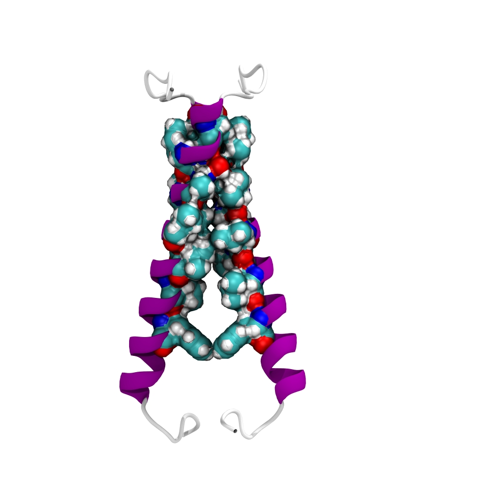

# HelicalFMO

## UNDER ACTIVE DEVELOPMENT (11.04.2025)

__To do__
1. Move command line inputs into a YAML format.
2. Add the rotation code.
3. Go through and implement fault tolerance.
4. Go through and implement Logger.
5. Implement a cross-angle and Left/Right handedness.
6. Implement a slab model to approximate an implicit lipid bilayer.
7. Implement ANI-X2 force field to measure potential energy (of the full TM peptide-peptide).

---

Fragment Molecular Orbital analysis for inter-helical transmembrane dimer residue interactions. 

<p align="center">
    
</p>

This code performs several operations:

1. Generated _de novo_ transmembrane dimers.
2. Rotates helical transmembrane dimers and writes to PDB files.
3. Writes nearest residue-residue atomic records to PDF files. 
4. Caps isolated peptide fragments with hydrogen atoms to ensure the overall formal charge is consistent with the original structure. 
5. Generates GAMESS input file for FMO analysis based on nearest residue-residue PDB files.
6. Performs 1 to 5 at scale.

## Isolating protein-protein interaction residues

### Command line parameters
- ```--mode``` Set to ```contact_distance ``` to isolate protein-protein interaction residues.
- ```--file``` The PDB input file. The file must contain only two chains, A and B. All other chains are ignored.
- ```--folder``` Path to a folder containing one or more PDB input files. This is an alternative choice to the single input ```--file``` parameter.
- ```--output_folder``` For each input file (whether that's a single file or a directory of files), a corresponding results PDB and data file will be saved to this location. The PDB file contains only those residues within contact distance, and the data file contains two lists of isolated residues. 
- ```--distance_cutoff``` (default 3 angstrom) An atom-to-atom distance measure between residues. Residue pairs within (<=) 
the cutoff distance are kept as interaction residues.
- ```--renum_chains``` Renumbers the residues on chain X from residue N e.g., A:1 renumbers residues, begging from "1", on chain A. For both chains, e.g., A:1 B:5, renumbers chain A beginning with "1", and chain B, beginning with "5". This operation
ensure hydrogen atom caps are added to the correct FMO fragment. Problems will occur if a chain has disordered or missing residue numbers e.g., 3, 4, 6, 11, 12, or 1, 3, 4, 7, 5.
The code uses the sequential order of residue numbers to determine whether there is a break in the peptide backbone, and therefore, a hydrogen atom cap is required. 
- ```--ignore_num_start_res``` Ignores all residues up to this residue e.g., ```5``` ensures the first four residues are ignored. Uses residue number. Renumber with ```--renum_chains``` if necessary.  
- ```--ignore_num_end_res``` Ignores all residues after this residue e.g., ```26``` ensures all residues after the 26th are ignored. Uses residue number. Renumber with ```--renum_chains``` if necessary.  

For example, to isolate interaction residues within 3 angstrom, while renumbering the residues of chain B (from residue 1): 
```
python helical_FMO.py --file C:\Users\Anthony\PyCharmProjects\HelicalFMO\structures\4auo_single_chains_AB.pdb --mode contact_distance --output_folder C:\Users\Anthony\PyCharmProjects\HelicalFMO\temp\ --distance_cutoff 3 --renum_chains B:1
```

## Preparing PDB files for GAMESS FMO input file generator

Before generating a GAMESS FMO input file, we need to ensure the input PDB file is formatted for such purpose. This is tricky, and getting it wrong will add artificial energy contributions to the FMO analysis. Read carefully. 

Having isolated the interaction residues at the helix-helix interface (using the steps above), we need to cap those residues that lost their 
peptide-bond neighbouring residue e.g., of ARG-LYS-PRO-CYS, only LYS and CYS were within the contact cutoff, therefore they have both lost their peptide-bond to a neighbouring residue. 

Capping involves adding a hydrogen atom to the cut nitrogen atom on the N-terms and a hydrogen atom to the cut carbon-carbonyl atom
on the C-term, both, part of the peptide backbone. Then a very short geometry optimisation is performed using PSI4 while keeping the original atoms
restrained. Adding hydrogen caps ensures that the residue retains its typical formal charge. 

Note: the first residue on each chain must have started with a resid of 1 during protein-protein interaction residue steps detailed above. Also, the N and C terms of each chain are down to the User's discretion. 
Setting the residue IDs to 1 instructs the program to avoiding adding a hydrogen atom cap to original N and C terms. If, for example, the protein-protein
interaction step rejects the first residue on a chain (because it wasn't within a cutoff of a residue from the neighbouring chain), the first residue read will have a residue ID of 2. 
The software, will know to add a hydrogen cap to that residue. 

### Command line parameters
- ```--mode``` Set to ```cap ``` to add hydrogen cap atoms to cut residues.
- ```--file``` The PDB input file. The file must contain only two chains, A and B. It's likely this file will have been generated having first performed ```--mode contact_distance```.
- ```--folder``` Path to a folder containing one or more PDB input files. This is an alternative choice to the single input ```--file``` parameter.
- ```--output_folder``` For each input file (whether that's a single file or a directory of files), new capped PDB files will be saved to this location.

For example, we cap a file refined to only include residues on both chains within a 3 angstrom interchain cutoff distance. A new file is saved to the ```--output_folder``` location.  
```
--file C:\Users\Anthony\PyCharmProjects\HelicalFMO\temp\contacts_0.pdb --mode cap --output_folder C:\Users\Anthony\PyCharmProjects\HelicalFMO\temp\
```

## Generating GAMESS FMO input files

This code builds a GAMESS input file for FMO analysis. All residues in ```--file``` will be included. It's essential to run ```--mode cap``` before (see above) 
to prepare the PDB file. This ensures the appropriate residues are included from a well-formed PDB file; residues IDs start from 1, and peptides are delimited by Chain A and B. 

The GAMESS input file is stored in ```--output_folder```.

### Command line parameters
- ```--mode``` Set to ```fmo ``` to build GAMESS FMO input files.
- ```--file``` The path a PDB input file.
- ```--output_folder``` The folder path to the generated GAMESS FMO input file. 
- ```--basis``` The basis set added to the GAMESS input file. Options are ```STO-3G``` (default) and ```"6-31G*"```. They represent low and reasonable accuracy, respectively.  
- ```--theory``` The level of quantum theory added to the GAMESS input file. Options are ```HF``` (default) and ```MP2```.

For example...
```
python helical_FMO.py --file C:\Users\Anthony\PyCharmProjects\HelicalFMO\temp\contacts_0.pdb --mode fmo --output_folder C:\Users\Anthony\PyCharmProjects\HelicalFMO\temp\ --basis STO-3G --theory HF
```
